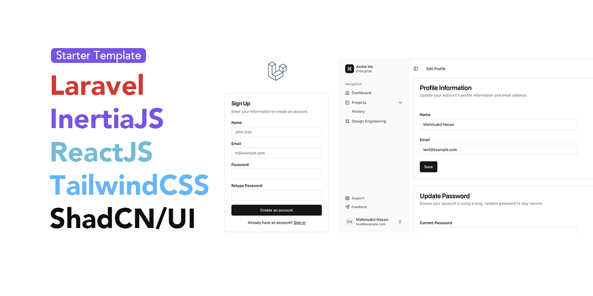

# Project Manager

A modern and intuitive project management application built with Laravel, React, and Shadcn UI. Manage your projects, tasks, and team collaborations efficiently with a beautiful and responsive interface.



## Features

- **Project Management**: Create, organize, and track projects effortlessly
- **Task Management**: Break down projects into manageable tasks
- **Team Collaboration**: Invite team members and assign tasks
- **Real-time Notifications**: Stay updated with project activities
- **Project Progress Tracking**: Monitor project status and completion
- **Modern UI/UX**: Built with Shadcn UI for a beautiful user experience
- **User Authentication**: Secure login and registration system

## Tech Stack

- **Backend**: Laravel 11
- **Frontend**: React with TypeScript
- **UI Framework**: Shadcn UI
- **State Management**: Inertia.js
- **Database**: MySQL
- **Authentication**: Laravel Breeze

## Prerequisites

Before you begin, ensure you have met the following requirements:

- PHP >= 8.2
- Composer
- Node.js & npm
- MySQL or another compatible database

## Installation

1. Clone the repository:
   ```bash
   git clone https://github.com/mahmudz/laravel-shadcn-app-panel.git
   cd laravel-shadcn-app-panel
   ```

2. Install PHP dependencies:
   ```bash
   composer install
   ```

3. Set up environment variables:
   ```bash
   cp .env.example .env
   # Configure your database and other settings in .env
   ```

4. Generate application key:
   ```bash
   php artisan key:generate
   ```

5. Run database migrations:
   ```bash
   php artisan migrate
   ```

6. Install and build frontend assets:
   ```bash
   npm install
   npm run dev   # for development
   # or
   npm run build # for production
   ```

## Development

To start the development server:

1. Start Laravel server:
   ```bash
   php artisan serve
   ```

2. Start Vite development server:
   ```bash
   npm run dev
   ```

Access the application at `http://localhost:8000`

## Contributing

Contributions are welcome! Feel free to submit issues and pull requests.

## License

This project is open-sourced software licensed under the [MIT license](LICENSE).
